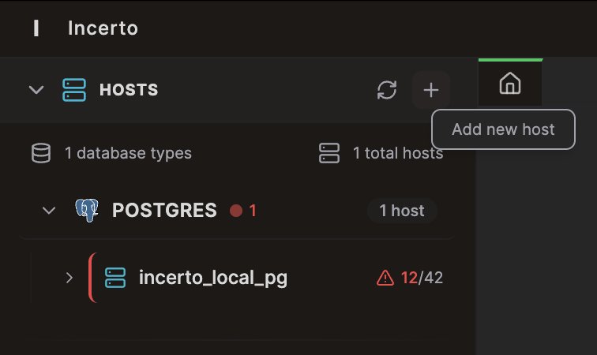

# Features

Work on databases faster with Incerto.

### Context On Fingertips

  

    Type **`@`** to provide information to Agents, including databases, tables, schemas, firing problems, or custom templates.
  

  

    
  

### Context On Fingertips

  

    Type **`@`** to provide information to Agents, including databases, tables, schemas, firing problems, or custom templates.
  

  

    
  

